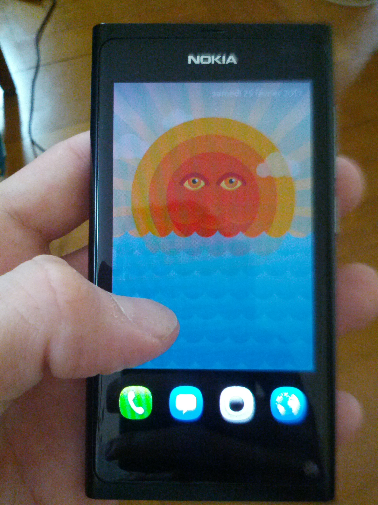

# Documentation sur le Nokia N9

------------------
Table des matières
==================
- Allumer l'appareil
- L'éteindre
- Le bloquer
- L'interface graphique
  > Notifications

  > Les applications

  > Gestionnaire de multi-tâche
- Le débloquer
- Ouvrir une application
- Fermer une application
  > Depuis une application

  > Depuis le gestionnaire de multi-tâche
- Minimiser une application
- Maximiser une application
- Réaliser un appel
  > Depuis le fond d'écran

  > Depuis l'application `Téléphone`
- L'application `Téléphone`
- Utiliser le clavier
- Créer un contact
  > Depuis l'application `Téléphone`

  > Depuis l'application `Contacts`
- Prendre une photo
- Voir les photos
- Écrire un SMS
- Configurer une alarme
- Modifier la date
  > L'heure

  > La date

## Allumer l'appareil
Sur le côté droit du téléphone portable se trouve 3 boutons.
Les deux premiers servent à gérer le volume et celui en bas à allumer le téléphone portable.
Il est nécessaire d'appuyer au minimum 3 secondes sur ce bouton.
Une lumière s'allumera en bas à gauche, le logo de `Nokia` apparaitra et le démarrage sera définitivement lancé lorsque un vibrement retentira.

## L'éteindre
Il faut premièrement déverrouiller l'appareil et appuyer au minimum 4 secondes pour éteindre l'appareil. Il faut utiliser le même bouton que pour l'allumer.

## Le bloquer
Allumer, éteindre, puis bloquer. Tout ça à travers le même bouton !
Un léger appui assombrira immédiatement l'écran pour finalement afficher l'écran de veille.

## L'interface graphique
Il existe trois niveau. Le premier est l'écran de veille.

Le second est l'écran de déverrouillage.

Et le dernier niveau, l'accueil, comporte 3 pages.
Il suffit de balayer d'un sens à l'autre pour atteindre la page souhaitée.

### Notifications
C'est la page qui se trouve à gauche et qui affichera toutes les notifications. Dans le cas actuel, seul les appels manqués et les SMS nos lus y seront affichés.

### Les applications
La page du milieu affiche toutes les applications représentées par des icônes. Il suffit d'appuyer sur l'icône pour ouvrir l'application.

### Gestionnaire de multi-tâche
L'écran de droite affiche toutes les applications qui ont été minimisées. Il suffit d'appuyer sur une vignette pour la maximiser.

Si aucune application n'a été minimisé la page sera noire.

## Le débloquer
### Avec le bouton
Appuyer sur le même bouton que les 3 actions expliqués au début de ce mode d'emploi, pour voir l'appareil sortir de l'écran de veille et afficher le fond d'écran.
Ensuite, il faut glisser avec son doigt depuis l'extrémité de n'importe quel côté.
Le fond d'écran accompagnera le doigt. Faire le geste entier (d'un bord à son opposé), pour débloquer l'appareil.

### Avec son doigt
Au lieu d'appuyer sur le bouton, tapoter 2 fois de suite avec un faible intervalle.

## Ouvrir une application
Pour ouvrir une application, il faut déverrouiller l'appareil et ensuite atteindre la page contenant toutes les icônes arrondies.

## Fermer une application
### Depuis une application
En ayant une application ouverte, il est possible de la fermer en balayant avec son doigt du haut de l'écran vers le bas. Il est extrêmement important de partir depuis le bord de l'écran.
Si un processus de fermeture est lancé, l'écran s'assombrira.

### Depuis le gestionnaire de multi-tâche
Il est également possible de fermer une application depuis le gestionnaire de multi-tâche. Pour cela, balayer à gauche ou à droite jusqu'à arriver sur cette page :

Appuyer longuement au centre de l'écran jusqu'à obtenir cela :

Il est possible de fermer une application une à une en appuyant sur le croix rouge en haut à droite de la vignette.
Pour fermer toutes les applications cliquer sur le bouton `Fermer tout`.

## Minimiser une application
Pour minimiser une application, il suffit de balayer d'une extrémité à l'autre en partant d'un bord. Attention, ne fonctionne pas de haut en bas, car ça fermera l'application.

## Maximiser une application
Pour maximiser une application, il faut retourner sur l'écran principal avec les trois pages et balayer jusqu'à arriver sur le gestionnaire multi-tâche.

Cliquer sur une vignette et l'application s'ouvrira automatiquement.

## Réaliser un appel
### Depuis le fond d'écran
Débloquer l'appareil, pour atterrir sur le fond d'écran.

Positionner son doigt au bord inférieur du téléphone, et monter lentement son doigt vers le haut.
Attendre un moment et le téléphone affichera 4 icônes en bas. Cliquer sur celle tout à gauche.

### Depuis l'application `Téléphone`
Débloquer l'appareil. Glisser vers la gauche ou vers la droite pour atterrir sur l'écran principal.
Sur cet écran, se trouve toutes les icônes permettant d'accéder aux applications.
Appuyer sur l'application `Téléphone`.

## L'application `Téléphone`
Cette application est composée de 3 écrans. Pour changer d'écran, il faut appuyer sur les icônes en bas de l'écran.
L'onglet principal (au milieu) permet de:
- Réaliser un appel
- Créer un contact

L'onglet de gauche, affiche la liste des derniers appels.

En appuyant sur la bannière verte, il est possible de filtrer l'affichage des appels. Voici les différentes options existantes:
- Derniers appels
- Appels en absence
- Appels reçus
- Appels composés

Pour quitter ce menu, il faut appuyer sur la croix ou en dehors des options.

L'écran de droite, affiche ses contacts. Appuyer sur le contact et ensuite sur le numéro de téléphone pour passer un coup de fil.

## Utiliser le clavier
La disposition des lettres est similaire à celle d'un clavier d'ordinateur.

Pour insérer d'autres caractères (ùöàä, etc.), appuyer longuement sur la lettre jusqu'à l'obtention d'autres choix.

Les chiffres et les signes sont uniquement accessibles en appuyant sur la touche `?123` en bas à gauche.

## Créer un contact
### Depuis l'application `Téléphone`
Ouvrir l'application `Téléphone`, aller sur l'onglet du milieu (celui pour composer des appels).

Insérez le numéro de votre interlocuteur et appuyer sur le bouton avec un visage et un plus.

L'application demandera s'il faut `Fusionner` le contact ou l'`Ajouter`.

`Fusionner` ne fera qu'ajouter le numéro dans un contact déjà existant, contrairement à `Ajouter` qui créera un nouveau contact.

### Depuis l'application `Contacts`
Pour créer un contact depuis l'application `Contacts`, il faut l'ouvrir et cliquer sur le `+` en bas à gauche.

## Prendre une photo
Pour prendre une photo, ouvrir l'application `App. photo` et appuyer sur le bouton représentant un appareil photo en bas au milieu.

## Voir les photos
Pour voir les photos, ouvrir l'application `Galerie`.

## Écrire un SMS
Pour rédiger un SMS, ouvrir l'application `Messages`.

## Configurer une alarme
Pour configurer une alarme, ouvrir l'application `Horloge` et appuyer sur le bouton `+` à droite dans la partie inférieure de l'écran.

Il n'est pas obligatoire de nommer l'alarme.
Vous verrez deux cercles. Celui à l'extérieur représente les minutes et celui à l'intérieur les heures.
Pour changer l'heure, il suffit d'appuyer sur un des deux ronds et le tourner en suivant le cercle.
Appuyer sur le bouton `Enregistrer` en haut à droite pour valider.

Il sera ensuite possible d'activer ou de désactiver cette alarme en appuyant sur la surface orangée.

Par ailleurs, une cloche apparaîtra en haut à droite. Si aucune alarme n'est activée, cette cloche disparaîtra.

## Modifier la date
À priori, dès qu'une carte SIM est insérée, l'heure ne devrait pas être configurée manuellement. Le téléphone portable s'en chargera tout seul.

### L'heure
Pour modifier l'heure manuellement, il faut ouvrir l'application `Paramètres` et descendre pour atteindre le menu `Heure et langue`. Cliquer dessus.

Ensuite, il faudra appuyer sur `Heure et date` et `Heure`.

Vous verrez deux cercles. Celui à l'extérieur représente les minutes et celui à l'intérieur les heures.
Pour changer l'heure, il suffit d'appuyer sur un des deux ronds et le tourner en suivant le cercle.
Appuyer sur le bouton `Terminé` en haut à droite pour valider.

### La date
Pour modifier la date, il faut ouvrir l'application `Paramètres` et descendre pour atteindre le menu `Heure et langue`. Cliquer dessus.

Ensuite, il faudra appuyer sur `Heure et date` et `Date`.

Pour atteindre le bon mois et la bonne année, il faut balayer la partie inférieure de l'écran, là ou est affiché le calendrier.
Continuer jusqu'à obtenir le bon mois et la bonne année. Appuyer sur un jour. Il sera différencié des autres.
Cliquer sur `Terminé` pour valider.

